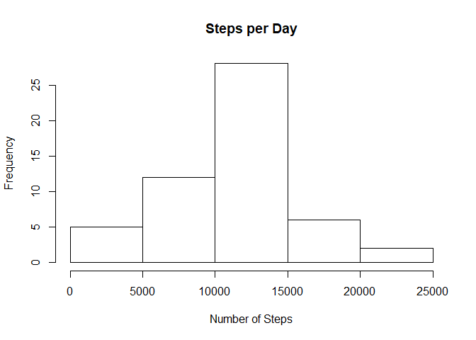
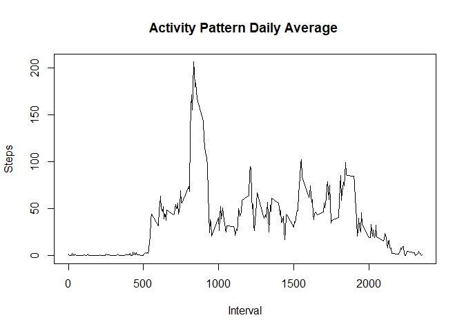
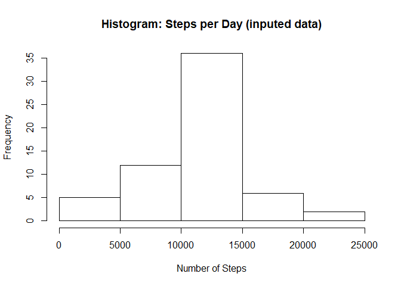
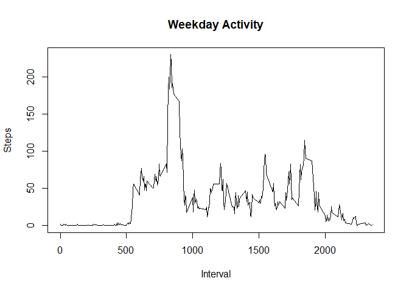
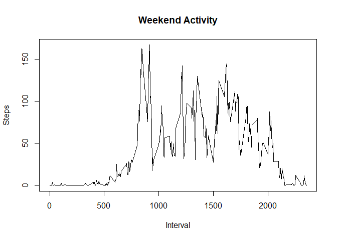

R Markdown
----------

This is an R Markdown document. Markdown is a simple formatting syntax
for authoring HTML, PDF, and MS Word documents. For more details on
using R Markdown see <http://rmarkdown.rstudio.com>.

LOADING and PREPROCESSING THE DATA
==================================

Set Directory and Load Libraries
--------------------------------

    setwd("H:/Projects/RepResProj1")

    library(ggplot2)
    library(plyr)
    library(data.table)

    ## Warning: package 'data.table' was built under R version 3.5.1

    library(lattice)
    library(tidyr)

1. Load the data (i.e. read.csv())
----------------------------------

### Data download

    fileUrl <- "https://d396qusza40orc.cloudfront.net/repdata%2Fdata%2Factivity.zip"

    download.file(fileUrl, destfile = 
      paste0(getwd(), '/repdata%2Fdata%2Factivity.zip'))

    unzip("repdata%2Fdata%2Factivity.zip",exdir = "data")

### Reading in CSV

    activity <- read.csv("data/activity.csv")

WHAT is MEAN TOTAL NUMBER of STEPS TAKEN PER DAY?
=================================================

1. Calculate the total number of steps taken per day
----------------------------------------------------

    Total_Daily_Steps <- tapply(activity$steps, activity$date, sum)

2. HISTOGRAM of the total number of steps taken per day
-------------------------------------------------------

### Histograms show distributions of variables. Bar charts compare variables.

    hist(Total_Daily_Steps, xlab = "Number of Steps", 
      main = "Steps per Day")

3. Calculate and report the mean and median of the toal number of steps taken per day
-------------------------------------------------------------------------------------

    Mean_Per_Day <- mean(Total_Daily_Steps, na.rm = TRUE)
    Median_Per_Day <- median(Total_Daily_Steps, na.rm = TRUE)

    print(Mean_Per_Day)

    ## [1] 10766.19

    print(Median_Per_Day)

    ## [1] 10765

WHAT is the AVERAGE DAILY ACTIVITY PATTERN?
===========================================

1. Time series plot (i.e. type = "l") of the 5 min interval (x) and average number of steps taken, avergaed accross all days (y)
--------------------------------------------------------------------------------------------------------------------------------

    Steps_Interval <- tapply(activity$steps, activity$interval, mean, na.rm = TRUE)
    plot(as.numeric(names(Steps_Interval)), 
         Steps_Interval, xlab = "Interval", 
         ylab = "Steps", main = "Activity Pattern Daily Average ", 
         type = "l")

2. Which 5 min interval, on average across all the days in the datatset, contains the maximum number of steps?
--------------------------------------------------------------------------------------------------------------

    Interval_Max <- names(sort(Steps_Interval, decreasing = TRUE)[1])
    Steps_Max <- sort(Steps_Interval, decreasing = TRUE)[1]

INPUTING MISSING VALUES
=======================

1. Calculate and report the total number of missing values in the dataset (i.e. the total number of rows with NAs)
------------------------------------------------------------------------------------------------------------------

    Missing_Values<- sum(is.na(activity$steps))

    print(Missing_Values)

    ## [1] 2304

2. Devise a strategy for filling in all of the missing values in the dataset.
-----------------------------------------------------------------------------

### Replace NAs with the mean number of steps for interval

3. Create new dataset equal to the original dataset with missing data filled in
-------------------------------------------------------------------------------

    Steps_Interval <- tapply(activity$steps, activity$interval, mean, na.rm = TRUE)

### Split by interval

    Activity_Split <- split(activity, activity$interval)

### Fill NAs

    for(i in 1:length(Activity_Split)){
      Activity_Split[[i]]$steps[is.na(Activity_Split[[i]]$steps)] <- Steps_Interval[i]
    }
    Activity_Input <- do.call("rbind", Activity_Split)
    Activity_Input <- Activity_Input[order(Activity_Input$date) ,]

4. Make histogram of total number of steps taken each day and calculate and report the mean and median total number of steps. Differing values? impact?
-------------------------------------------------------------------------------------------------------------------------------------------------------

    Total_Daily_Inputed <- 
      tapply(Activity_Input$steps, Activity_Input$date, sum)

    hist(Total_Daily_Inputed, xlab = "Number of Steps", main = "Histogram: Steps per Day (inputed data)")

    Mean_Day_Input <- mean(Total_Daily_Inputed, na.rm = TRUE)
    Median_Day_Input <- median(Total_Daily_Inputed, na.rm = TRUE)

    print(Mean_Day_Input)

    ## [1] 10766.19

    print(Median_Day_Input)

    ## [1] 10766.19

ARE THERE DIFFERENCES in ACTIVITY PATTERNS BETWEEN WEEKDAYS AND WEEKENDS?
=========================================================================

1. Create a new factor variable in the dataset with two levels - "weekday" and "weekend"
----------------------------------------------------------------------------------------

    Activity_Input$day <- 
      ifelse(weekdays(as.Date(Activity_Input$date)) 
      == "Saturday" | weekdays(as.Date(Activity_Input$date)) 
      == "Sunday", "weekend", "weekday")

2. Make panel plot containing time series plot (type "l") od 5 min interval (x) and the average number of steps taken, averaged.
--------------------------------------------------------------------------------------------------------------------------------

### Average steps for weekends

    Steps_Interval.weekend <- 
      tapply(Activity_Input[Activity_Input$day
      == "weekend" ,]$steps, Activity_Input[Activity_Input$day 
      == "weekend" ,]$interval, mean, na.rm = TRUE)

### Average steps for weekdays

    Steps_Interval.weekday <- 
      tapply(Activity_Input[Activity_Input$day 
      == "weekday" ,]$steps, Activity_Input[Activity_Input$day 
      == "weekday" ,]$interval, mean, na.rm = TRUE)

### Create 2 panel plot

    par(mfrow=c(1,2))

### Weekday activity

    plot(as.numeric(names(Steps_Interval.weekday)), 
         Steps_Interval.weekday, xlab = "Interval", 
         ylab = "Steps", main = "Weekday Activity", 
         type = "l")

### Weekend activity

    plot(as.numeric(names(Steps_Interval.weekend)), 
         Steps_Interval.weekend, xlab = "Interval", 
         ylab = "Steps", main = "Weekend Activity", 
         type = "l")

